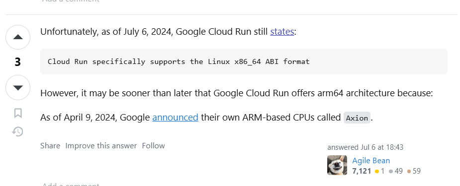
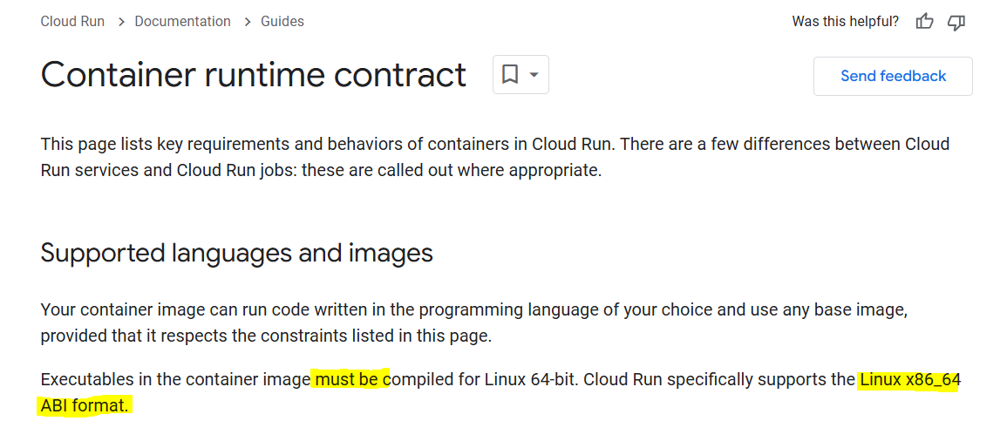

# 🚀 Multi-Architecture Docker Build and Deploy to Google Cloud Run

This repository demonstrates how to build **multi-architecture Docker images (AMD64 and ARM64)** using **Docker Buildx** and deploy them to **Google Cloud Run** (for AMD64 only). The ARM64 build intentionally fails during deployment to Cloud Run, as ARM64 is not supported by Cloud Run, to explore Docker multi-architecture builds for learning purposes.

---

---

<!-- ## 📋 Table of Contents
1. [Project Overview](#project-overview)
2. [Technologies Used](#technologies-used)
3. [Architecture Overview](#architecture-overview)
4. [Workflow Setup](#workflow-setup)
   - [1. AMD64 Workflow](#1-amd64-workflow)
   - [2. ARM64 Workflow](#2-arm64-workflow)
5. [Learning Objective](#learning-objective)
6. [Getting Started](#getting-started)
7. [Secrets Configuration](#secrets-configuration)
8. [Deployment URLs](#deployment-urls)

--- -->

## 🌟 Project Overview
This project focuses on:
1. Building Docker images for both **AMD64** and **ARM64** architectures using Docker Buildx.
2. Deploying the AMD64 image to **Google Cloud Run**.
3. Studying and understanding multi-architecture builds by intentionally deploying ARM64, which fails as **ARM64 is not supported in Google Cloud Run**.

---

## 🛠️ Technologies Used
- **Google Cloud Run**: For serverless container hosting (AMD64 only).
- **Google Artifact Registry (GAR)**: To store Docker images.
- **GitHub Actions**: For CI/CD workflows.
- **Docker Buildx**: To build multi-platform Docker images.

---

## 🏗️ Architecture Overview
- **Input**: Source code is pushed to the `master` branch.
- **Pipeline Steps**:
  1. Authenticate with Google Cloud.
  2. Build architecture-specific Docker images (`AMD64` and `ARM64`).
  3. Push images to **Google Artifact Registry (GAR)**.
  4. Deploy **AMD64** image to **Google Cloud Run**.
  5. Attempt to deploy **ARM64** image to Cloud Run, which fails due to lack of support.

---

## 📋 Workflow Setup

### **1. AMD64 Workflow**
The workflow file is located at `.github/workflows/build-and-deploy-amd.yml`.

#### Steps:
1. Authenticate with Google Cloud using `google-github-actions/auth`.
2. Build an `AMD64` image using Docker Buildx.
3. Push the image to Google Artifact Registry.
4. Deploy the containerized application to Google Cloud Run for `AMD64`.

---

### **2. ARM64 Workflow**
The workflow file is located at `.github/workflows/build-and-deploy-arm.yml`.

#### Steps:
1. Authenticate with Google Cloud using `google-github-actions/auth`.
2. Build an `ARM64` image using Docker Buildx.
3. Push the image to Google Artifact Registry.
4. Attempt to deploy the containerized application to Cloud Run for `ARM64` (fails as ARM64 is unsupported).

---

## 🎯 Learning Objective
This project is intentionally designed to:
1. Understand and implement multi-architecture Docker builds using Docker Buildx.
2. Explore the limitations of deployment platforms like Google Cloud Run (ARM64 is not supported).
3. Simulate real-world scenarios where architecture constraints may arise during deployment.

---

## 🚀 Getting Started

### Prerequisites:
1. **Google Cloud Project**: Make sure you have a project set up.
2. **Google Artifact Registry**:
   - Create separate repositories for AMD64 and ARM64.
   - Example repositories:
     - `amd64-repo`
     - `arm64-repo`
3. **GitHub Secrets**: Configure the required secrets in your repository settings.

---

## 🔑 Secrets Configuration

Add the following secrets to your GitHub repository:
| Secret Name           | Description                                     |
|-----------------------|-------------------------------------------------|
| `GCP_CREDENTIALS`     | JSON key of your Google Cloud Service Account. |
| `GAR_REGION`          | Region of your Google Artifact Registry (e.g., `us-central1`). |
| `PROJECT_ID`          | Google Cloud Project ID.                       |
| `GCR_SERVICE_AMD`     | Cloud Run service name for `AMD64`.            |
| `GCR_SERVICE_ARM`     | Cloud Run service name for `ARM64`.            |
| `GAR_NAME_AMD`        | Docker image name for `AMD64`.                 |
| `GAR_NAME_ARM`        | Docker image name for `ARM64`.                 |
| `GAR_REPO_NAME_AMD`   | Artifact Registry repository for `AMD64`.      |
| `GAR_REPO_NAME_ARM`   | Artifact Registry repository for `ARM64`.      |
| `GCP_REGION`          | Deployment region for Cloud Run (e.g., `us-central1`). |

---

## 🌐 Deployment URLs
After successful deployment, the services can be accessed at:

| Architecture | Deployment Status   | Deployment URL                                               |
|--------------|---------------------|-------------------------------------------------------------|
| **AMD64**    | Successful          | `https://<GCR_SERVICE_AMD>-<GCP_REGION>.a.run.app`          |
| **ARM64**    | Failed (Expected)   | N/A                                                         |

Replace `<GCR_SERVICE_AMD>` with the Cloud Run service name and `<GCP_REGION>` with the deployment region.

---

## 🧹 Cleaning Up
To avoid unnecessary charges:
1. Delete the deployed AMD64 service from Google Cloud Run.
2. Remove both AMD64 and ARM64 images from Google Artifact Registry.
3. Delete unused Google Cloud resources.

---

## 📝 Proof Of Work

Below are the Proofs that GCP doesnt supports the ARM64 architecture as of the repo published  

 

Below are the url's that are generated by the usecase of this project

| Architecture | Deployment Status   | Deployment URL                                               |
|--------------|---------------------|-------------------------------------------------------------|
| **AMD64**    | Successful          | `https://archfleet-backend-amd64-97415322905.asia-southeast1.run.app/` |
| **ARM64**    | Failed (Expected)   | `https://archfleet-backend-arm64-97415322905.asia-southeast1.run.app/` |

Below Images shows the Deployment being failed because of the **ARM64** Architecture
 

 

 
 

Below Images shows the Deployment being Success because of the **AMD64** Architecture
 

 

---

## 👥 Acknowledgements
- **Google Cloud** for providing serverless deployment capabilities.
- **Docker Buildx** for enabling multi-platform image building.
- **GitHub Actions** for a smooth CI/CD experience.
